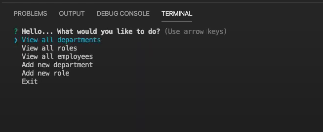

# Employee Tracker CLI
This is the HW-10-employeeTracker assignment for the Northwestern University Coding Program

## Table of Contents
* Description
* Installation Instructions
* How to Use
* Demo Link
* Screenshot
* Additional Questions   

## Description 
This assignment is a command line interface that provides users and tool for tracking information about their company. This includes departments, roles, and employees. By using a mySQL database, all company data will be stored properly. 

## Installation Instructions
1. Set up your database. Create your schema.sql and add in the initial seed values from your workbench. 
2. In the same directory as package.json, run "``` npm install ```" to install the required modules.
3. Add your specific database password in the connection.js file. 

## How to Use
Make sure your terminal is in the correct directory. Then type "```node app.js```".

## Demo Link 
[Unlisted YouTube Video Demo](https://youtu.be/jx_BDVmdYA0)

## Screenshot



## Additional Questions
If you have any questions about the project or would like to contact me, please reach out through GitHub.

[Jake Wagner on GitHub](https://github.com/jkwagneriii)
